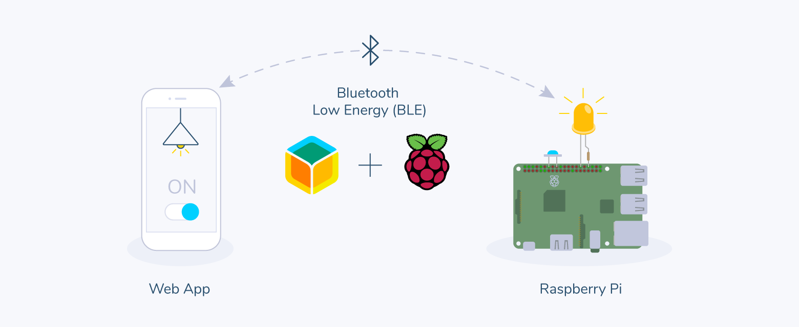

# Control your devices from a web browser using Bluetooth

This project uses the Web Bluetooth API and balena to control Bluetooth Low Energy (BLE) devices remotely from a browser.

## Hardware Required

1. A balenaOS supported device with BLE e.g Raspberry Pi 3A+/3B/3B+/Zero W/4B
2. An SD card
3. Power supply
4. LED
5. Resistor (above 50 Ohms, advisable to include for long test sessions)
6. A computer, laptop, or Android smartphone with BLE running the latest Chrome web browser
7. A push button
8. Breadboard to add ease to this test build (optional)

## Software Required

1. balenaEtcher to write balenaOS to SD card
1. A free balenaCloud account to set up and manage the Pi
1. A download of this project
1. Download and install balena CLI tools, which allows you to install the project code on your device

## Setup and Usage

Refer to the step by step [walkthrough](https://www.balena.io/blog/control-your-devices-from-a-web-browser-using-bluetooth/#walkthrough) in the blog post.

## Customization

This project can be used as a reference for developing your own solution.

- The `utils` directory contains `characteristics` and `services` relevant to the Bluetooth device we created. Feel free to explore [the bleno API](https://github.com/noble/bleno#actions) and experiment with other BLE properties and characteristics to make your own custom BLE peripheral device.

- `ble-client.js` contains code for connecting your browser(the client) to your bluetooth device.

- `index.html` is the UI for the client. The UI is being [hosted on GitHub pages](https://balenalabs-incubator.github.io/balena-web-ble/). You can choose your own solution.

## Acknowledgement

This project uses the [bleno library](https://github.com/noble/bleno) to create a BLE peripheral device.
